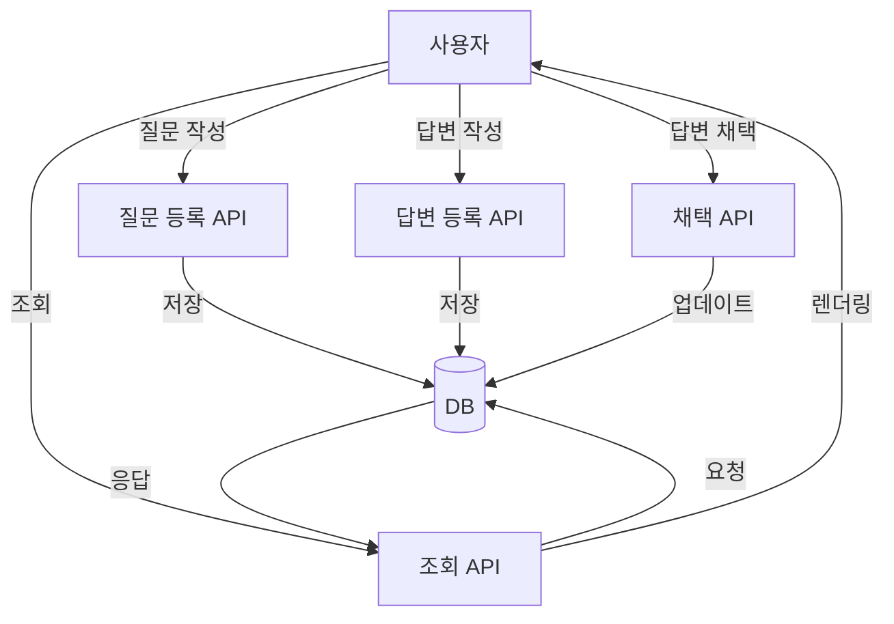

#  필챗(Pillchat)

약학대학 학생과 전문가를 위한 **질의응답 기반 학습 커뮤니티 서비스**입니다.  
AI 기반 이미지 인증 시스템과 약학 특화 Q&A 시스템을 갖춘 신뢰 기반 커뮤니티 플랫폼입니다.

---

##  프로젝트 개요

- **개발 기간**: 2025.01.12 ~ 현재 진행 중  
- **핵심 기술**: Spring Boot, MySQL, FastAPI, PaddleOCR, AWS EC2, JWT, OAuth2  
- **기여 역할**: 백엔드 설계 및 개발, AI 인증 서버 연동, 배포 인프라 구성 주도

---

##  관련 리포지토리

- 🔗 Spring Boot 서버: [Yakchat_Server](https://github.com/YakchatProject/Yakchat_Server)  
- 🔗 AI 인증 서버: [Pillchat_Ai](https://github.com/YakchatProject/Pillchat_Ai)

---

##  ERD

 <!-- 실제 이미지 경로에 맞게 수정 -->

---

##  AI 기반 회원 인증 시스템

**학생증 / 약사면허증을 기반으로 한 AI 자동 인증 프로세스**를 개발했습니다.

### 인증 흐름 요약

1. **회원 유형 선택**: 학생 / 전문가(약사)  
2. **증명 이미지 업로드**  
3. **AI 분석 처리**
   - 이미지 분류 (학생증/면허증 여부)
   - OCR 추출 및 키워드 검증
4. **입력폼 자동 채우기**
5. **이메일 인증 및 회원정보 입력**
6. **회원가입 완료**

> 사용자의 입력 부담을 줄이고, 허위 정보 방지를 위한 신뢰 기반 시스템입니다.

### 인증 시스템 작동 구조


---

##  질문 / 답변 시스템

약학 분야에 특화된 Q&A 시스템을 설계했습니다.



- 평균 응답 시간 800ms → 150ms 개선 (N+1 문제 해결)
- 이미지 포함 질문 업로드, 필터 기능 구현
- 답변 채택, 좋아요, 스크랩 기능 탑재
- 인기순/최신순 정렬 기능 제공

---

##  특화 기능

1. **전문가 인증 뱃지**  
   → 약사 인증 완료 시, 전문가 뱃지 표시 및 우선 노출

2. **이미지 기반 질문 업로드**  
   → 약물/처방전 사진 업로드 및 OCR 활용 가능

---

##  AWS 기반 데모 배포

### 배포 인프라 구성

- **EC2 + RDS(MySQL)** 기반 서버 운영
- **Route 53 + ACM + CloudFront**로 HTTPS 적용 및 콘텐츠 전송 가속
- **도메인 연결**, **보안 인증서 적용**, **DB 자동 복구 설정**

> CI/CD는 추후 GitHub Actions 기반으로 구축 예정입니다.

---

##  트러블슈팅

### 문제: Gradle 빌드 실패 (Java Toolchain 미인식)

```groovy
java {
    toolchain {
        languageVersion = JavaLanguageVersion.of(17)
    }
}
```

**원인**: EC2에는 JRE만 설치되어 있었고 JDK가 없어 Gradle Toolchain이 작동하지 않음  
**해결**:

```bash
sudo yum install java-17-amazon-corretto-devel -y
```

→ `./gradlew clean build` 정상 수행 확인됨

---

##  대표 이미지

> (필요시 아래 항목들은 실제 이미지 경로로 대체)

- 
- 

---
